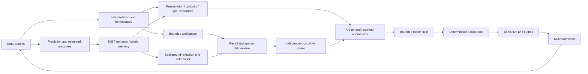

# Current release: v0.12

Read [START_V012.md](START_V012.md) and [V012_HANDOFF.md](V012_HANDOFF.md). Developmental muscle learning, observatory, and optional fast mode. Older release sections below are historical.

# Current release: v0.11

Read [START_V011.md](START_V011.md) and [V011_HANDOFF.md](V011_HANDOFF.md). Neutral muscle discovery and measured item-action learning now extend the council. Older sections below are historical.

# Current v0.10 architecture

See `V010_HANDOFF.md` and `START_V010.md` for the current version. The Minecraft council adds competing preservation/curiosity/goal agents, spatial and semantic memory, outcome-driven motor programs and background reflection. Model calls use one shared backend, with independent planner and critic roles. The event bus remains the shared substrate; only selected information enters the bounded global workspace.



The current council/skill controller is mostly deterministic and heuristic; the two inference roles provide sparse semantic guidance/review and speech. This graph represents implemented functional paths, not evidence of consciousness or separate trained brains. Details below describe earlier milestones and should be read as historical when they conflict with the v0.10 handoff.

# Historical v0.03 extension

The original core design below remains the deterministic regression architecture. Current Minecraft cognition adds independent interpretation, homeostasis, recall, prediction, consolidation, planner and cognitive critic agents through one shared local Ollama backend. See `NEXT_MODEL_HANDOFF.md` for the current event pipeline, compute limits, implementation choices and verification boundaries. `MinecraftBrain` coordinates shared inference outside SQLite transactions; only the executive produces Minecraft effects.

# Architecture implemented in v0.01

## Data path

```text
user.text -> perception.text -> attention.candidate -> workspace.broadcast -> executive.speech
                                 ^                        |
                                 |                        +-> episodic memory / self-model
                         memory corroboration

body.observation -> body model / homeostasis / salience -> workspace.broadcast
                                                            |
                                                            v
                                                        planner
                                                            |
                                                    action.proposed
                                                            |
                                                          critic
                                                            |
                                                    action.approved
                                                            |
                                                    executive.action
                                                      /           \
                                                prediction       actuator
                                                                   |
                                                               body.result
                                                            /      |       \
                                                      learning    memory   body model
```

The next explicit step observes the updated world. Planner decisions depend on selected body observations, not hidden simulator state. Prediction runs before actuation, and outcome processing updates a persistent position/action transition table. After an unanticipated collision, a repeated transition can predict the blocked outcome. The map also changes future route selection.

## Files and responsibilities

| File | Responsibility |
|---|---|
| `schemas.py` | Typed persistent data and structured events |
| `config.py` | TOML loading, defaults, validation |
| `stores.py` | SQLite migrations, transactions, state, goals, self-model, lexical episodes, event inspection |
| `event_bus.py` | Registry, durable subscriptions, bounded causal routing, per-module traces |
| `scheduler.py` | Stable priority work order and inference reservation governor |
| `workspace.py` | Candidate scoring, corroboration, ignition, retention, capacity competition, decay |
| `world.py` | Private simulator truth and sensory/motor adapter |
| `modules.py` | Twelve small module implementations wired by subscriptions |
| `models.py` | Backend protocol and deterministic mock |
| `engine.py` | Dependency composition, startup, serialized runtime operations, shutdown |
| `cli.py` | Operator commands and executive-speech display |

## Delivery and recovery

Publishing an event inserts its canonical JSON, parent edges, and subscriber deliveries in one SQLite transaction. Each module handler commits its state changes, child events, trace, and completed delivery together. A failed handler rolls back those changes and records a failed delivery plus an error event. Cancellation rolls back the handler, leaving a pending delivery for restart. Only deterministic local effects are permitted inside this transaction model.

Pending deliveries recover on boot. A module disabled between runs gets a failed delivery record rather than silently disappearing. Failed handlers are not automatically retried in v0.01. Replaying an already accepted ID is suppressed. Repeated `(source, kind, content)` within the first parent's causal root is suppressed; independent experiences with the same content remain valid. Multiple parents retain all direct edges, while the first parent's root provides the suppression domain. Changing-payload loops are bounded by a hop limit and drain work budget.

The SQLite event/edge/trace tables prohibit updates and deletions through triggers. This protects the application's history from accidental rewrites; a filesystem owner can still alter the database. JSONL is a derived export, not a second authoritative log. Runtime time-accounting and initialization writes are described by boot/tick/shutdown events; detailed per-module traces apply to handler effects.

## Workspace approximation

Candidates receive a fixed weighted score over salience, novelty, relevance, urgency, and confidence. Fixed feature values are stub heuristics, not learned judgments. A fresh candidate gets a small carryover from its previous activation. An independent module's support increases activation once per candidate version. Above ignition threshold, eligible candidates compete for the limited active set. Existing selections retain access down to a lower threshold, providing hysteresis. Clock ticks decay activation; maximum age also removes stale entries.

The most recent body observation replaces the body-observation candidate. Other candidates have separate IDs. Newly selected content broadcasts to subscribed memory, planner, executive, and self-model components. A refreshed body observation can rebroadcast while active. Candidates displaced by capacity remain backstage until expired or evicted by the candidate bound. This is capacity competition, not a detailed simulation of lateral inhibition or spiking neural ignition.

Recurrence is currently strongest through body/action/outcome/map feedback, persistent workspace carryover, and memory corroboration of repeated text. This is not a rich learned recurrent neural substrate. Ablations and stronger heterogeneous support loops are follow-up experiments.

## Sensory boundary

`GridWorld` owns truth. `observe()` emits radius-limited, occluded cells plus body variables. The body model stores those cells, and planning operates on that map. Debug rendering can reveal truth for an evaluator, but the CLI defaults to the explored map. The actuator performs only the six allowed actions. Its result includes a fresh observation so post-action body state does not combine stale vision with a new position.

The grid's positions are proprioceptive abstractions. Vision is omnidirectional within Manhattan radius, with Bresenham line occlusion. Hearing, field of view, delayed/noisy sensations, velocity, and rendered frames are not implemented yet. Metabolism advances per action, not while the idle clock runs.

## Learning and identity

Learning consists of retaining sensed cells and empirical movement outcomes keyed by starting position and action. Counts record repeated evidence; this is a last-observation transition model for a deterministic environment. It is not policy learning or online LLM training. Exploration and food selection are hand-written bootstrap algorithms. Explicit user goals persist, but do not dynamically drive arbitrary plans yet.

Identity is a stable UUID with creation/last-seen timestamps, active process time, recent prediction failures, active goal IDs, and a simple food-episode summary. Configured capability values are placeholders, not calibrated performance scores. Raw episodes remain immutable when summaries change.

## Hardware and compute

v0.01 has no model weights and should use little RAM; disk growth is proportional to events and traces. It runs on the CPU. The future target is one shared llama.cpp server, initially a 4B Q4 GGUF on the 4070 Super 12 GB. No throughput or VRAM claim has been benchmarked by this release.

The governor reserves estimated input + output tokens, calls per rolling minute, concurrency, and wall time. Failed calls retain their reservation. Budget state currently lasts only for the process lifetime; external/API budgets must become durable before paid inference is introduced. Mock token counts are whitespace estimates. Background reservations, real tokenizer accounting, and actual model timing belong to the inference integration stage.

## Deviations from the handoff

The five supplied files were available; referenced bundle files 00-10 and 12 were not present in Downloads. The implementation follows the supplied master prompt's Phase 0 and the architecture spec, with the later user-approved tiny body and workspace feedback added as deterministic fixtures. No real model or Minecraft integration was added.

The project uses `python -m synthetic_mind` with a `src/` package rather than `python -m src.main`; launchers set the import path without installation. TOML replaces YAML to avoid dependencies. Semantic memory and advanced reflection are deferred; `MemoryStore` is a bounded lexical stub. Inspection and diagnostic output are distinct from executive speech. Model weights, credentials, and unrestricted external capabilities are absent.
