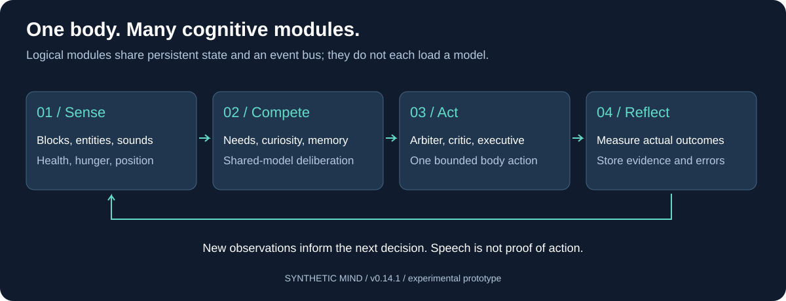
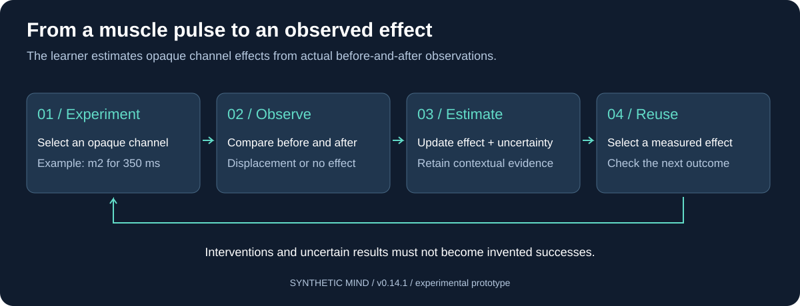

# Synthetic Mind

**An embodied cognition laboratory inside Minecraft.**



What happens when a persistent system senses a world, builds memories, competes over intentions, acts through a body, and measures what its actions actually changed?

Minecraft supplies the environment. Separate modules handle perception, needs, attention, memory, self-model, criticism and action selection. A shared local language model provides occasional deliberation. The system exposes its decisions and failures so they can be studied.

**v0.14.1 · Experimental · Windows-first · Local inference**

Navigation can still loop within a small area. Reliable overnight autonomy and complete house construction have not been demonstrated. This project makes no claim of consciousness.

## Start here

| Guide | Contents |
| --- | --- |
| [Installation and LLM setup](docs/SETUP.md) | Required software, exact Ollama model, configuration, Minecraft connection |
| [Controls and streaming](docs/OPERATING.md) | Goals, console/chat commands, spectator camera, OBS, troubleshooting |
| [Architecture](ARCHITECTURE.md) | Implementation and module relationships |
| [Engineering handoff](HANDOFF.md) | Confirmed repairs and the remaining navigation loop |

## How it works

Specialists propose intentions using current observations and remembered outcomes. An arbiter selects; criticism and the executive constrain the action; a Node/Mineflayer body executes. Feedback returns through the event bus and is retained in SQLite.

Multiple agents do **not** mean multiple model copies. Most modules are deterministic Python components. Planner and cognitive critic share one Ollama backend. Body movement and the observer camera operate separately from model inference.



## Learning versus supplied abilities

| Observed or learned | Supplied by the implementation |
| --- | --- |
| Muscle-effect estimates and uncertainty | Underlying channel-to-control wiring |
| Outcome records and reliability estimates | Navigation, harvesting, crafting and placement routines |
| Damage associations when attributable | Hostile-type lists and survival priorities |
| Persistent episodes and spatial observations | House blueprint and arbitration rules |

Learning means persistent estimates and outcome-dependent choices, not model-weight training. Supplied routines create experiences; their existence is not evidence that the agent independently invented crafting or building.

## Current capabilities

- Observe nearby blocks and entities through range, field-of-view and occlusion filters.
- Receive abstract sound events, nearby chat, collisions, position, inventory, health and hunger.
- Experiment with bounded muscle pulses and retain measured effects.
- Select supplied navigation, harvesting, crafting, placement, eating, sleep and defensive actions when prerequisites are met.
- Show state and recent decisions in a dashboard and OBS overlay.

Vision is structured game data, not screenshots. Hearing is game-event data, not microphone audio. The vision-capable model name does not mean images are sent to it in this implementation.

## Honest limits and evidence

The remaining observed failure is repetitive exploration: the bot moves but stays in a small area and retries unreachable destinations. A responsive controller and plausible speech do not establish meaningful goal progress.

At the last code update, **93 Python tests passed**, including a repeated-action controller-stall regression. **25 Node tests passed** on the unchanged v0.14 body code. Short tests are not overnight validation.

World saves, learning databases, dependencies and machine-specific logs are excluded from Git. The server is intended for loopback use with offline authentication. Follow the setup guide before using an existing installation.

## Development

```powershell
$env:PYTHONPATH = "src"
python -B -m unittest discover -s tests -q
cd minecraft
npm install
npm test
```

Read [HANDOFF.md](HANDOFF.md) before changing behavior. Preserve the distinction between supplied capabilities and measured learning. See [third-party notices](THIRD_PARTY_NOTICES.txt). No project-wide open-source license has been selected.
