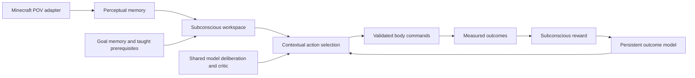

# v0.16: embodied module architecture

This release moves default action selection out of the fixed Minecraft survival council. Minecraft is the body adapter; the core consumes normalized observations, candidates, taught transformations, and measured outcomes.

## Runtime flow

The generic core is `src/synthetic_mind/embodied.py`; the boundary is `minecraft_embodiment.py`. The core contains no Minecraft material names, key mapping, hostile lists, or Minecraft action cases. Modules communicate through durable events. Senses continue while inference runs. Model suggestions nominate current candidate keys; they cannot invoke admin commands. Critic-reviewed suggestions receive a bounded score contribution, not exclusive motor control.

## Learning semantics

This is an online contextual utility learner, not a trained neural policy or a consciousness claim. It combines measured outcome values, uncertainty, resource prerequisites, needs, information seeking and repetition costs. Reward is its own background module. Health loss and death produce negative feedback with decaying temporal credit; that association is explicitly not proof of cause. Respawn does not erase memory or reward death. Recent episodes, procedural records and contextual estimates are persistent and bounded; the authoritative event history remains in SQLite.

Recipe and material-drop information is labeled supplied game knowledge. It is not presented as discovery. Recipe sensing uses the actual installed game registry. A crafting table must be visible and reachable, not found through hidden-world search. New sensory views are tracked, including pitch. The old learned muscle records remain intact.

## Body and operator boundaries

Removed the default experiment disablement by replacing the old selector; removed material/crafting whitelist validation, hostile-only targeting, and raw-muscle hazard vetoes. Minecraft physics and ordinary reach/visibility still apply. Protocol validation, cancellation and finite action durations remain to keep the runtime responsive. This does not mean every Minecraft interface is implemented: full furnace/trading/enchanting UI manipulation and simultaneous button chords remain future adapter work. Supplied look/equip/craft operations coexist with opaque muscle trials and must not be mislabeled as learned motor skills.

Default selection no longer uses the old supplied house-building, navigation, eating and threat policies. Those legacy modules remain available through the council configuration for regression comparison. The new architecture is less scripted; it does not guarantee house building or competent survival yet. Arbitrary natural-language goals currently receive limited resource-token dependency reasoning and model candidate advice, not a complete hierarchical planner.

## Controls

Run the desktop installation's `STREAM_START.cmd` for a visible console with autonomy, or `MINECRAFT_START.cmd` for a paused console. `/auto on`, `/auto off`, `/goal TEXT`, `/mind`, `/learning`, `/skills`, `/quit` remain available.

`/server time query daytime`, `/server difficulty normal`, `/server weather clear`, etc. route one command to the server owned by the launcher. This local operator-only channel has a per-launch token and expiring mailbox. It does not work when connecting to a server the launcher does not own. Command output is in `minecraft/server/launcher-server.log`.

Every player can use `!camera`, `!camera next`, `!camera follow`, `!camera side`, `!camera front`, `!camera overhead`, `!camera first`, and `!camera off`. Each player has an independent mode, distance and return marker. Example: `!camera side 8`. First-person uses native spectator attachment; it should be viewed in the client's first-person perspective. Other modes use obstruction-checked camera geometry. Players' previous game modes are recorded for restoration.

Dashboard: http://127.0.0.1:8765/ ; overlay: http://127.0.0.1:8765/overlay . Activity distinguishes emitted output (green), changed state (gold) and received input (blue). Click a region for module details. It is software instrumentation, not a brain scan.

## Validation and deployment

118 Python test executions and 27 Node tests passed. Coverage includes generic non-Minecraft action learning, death changing a subsequent choice after reopening the database, stale credit rejection, respawn reward exclusion, 30 motor cycles without orphaned busy reservations, viewpoint validation, real-registry recipe prerequisites, per-player command isolation and camera chat-log parsing.

One short installed-server session confirmed autonomous button activity, yaw and pitch changes, shared-model responses, and `/server time query daytime` reaching the server. No module delivery failures were observed in the integration fixture. Live multi-player camera transitions have NOT been exercised; command generation and parsing are tested. No overnight reliability claim. Original identity and worlds are preserved. Code backup: installation/backups/before-v016-20261009-112303/code.zip.

Shutdown previously regenerated all historical JSONL, delaying exit. It now exports the latest 10,000 events only; SQLite retains full history. Large existing database size and long-term archival remain unresolved. No history was deleted.

## Critic review priorities

1. Measure exploration effectiveness over longer runs; uncertainty-driven action sampling alone is not a curriculum.
2. Temporal harm credit can implicate unrelated recent actions. Improve causal attribution using observed damage-source evidence.
3. Context abstraction and reward weights are engineered. Check reward farming, cycling, and generalization across inventory/terrain changes.
4. Extend learned effects into multi-step planning and transferable executable skill composition.
5. Complete ordinary body interfaces and concurrent muscle activation without hidden-world access.
6. Validate multiplayer camera mode transitions live, including logout/rejoin and restoration.
7. Reduce event/write overhead and add explicit retention without losing learned evidence.

Do not claim full autonomous competence, consciousness, a completed long-horizon agent, or a critic score based only on passing unit tests.
